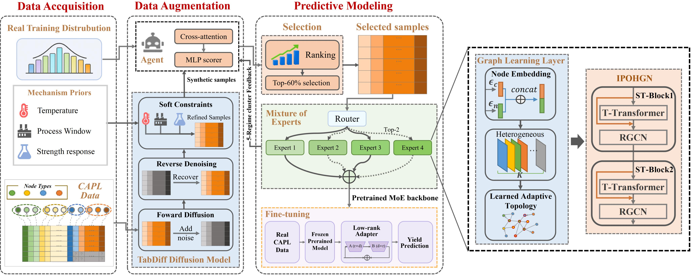

# 🔩 MTAM-HG: A Mixture-of-Experts Heterogeneous Graph Network with Agent-Regulated Diffusion Augmentation for Strip Yield Strength Prediction

<p align="center">
  <b>Mechanism-Prior Diffusion Augmentation · CBTG-Agent · Mixture-of-experts · Heterogeneous Graph Network </b>
</p>

<p align="center">
  
  
  
  
</p>

<p align="center">
  <a href="https://github.com/WeizhiZhang051029/MTAM-HG-A-Mixture-of-Experts-Heterogeneous-Graph-Network-with-Agent-Regulated-Diffusion-Augmentation">
    <b>Project Page</b>
  </a>
    |  
  <a href="#citation">
    <b>Paper</b>
  </a>
</p>

## 📌 Overview

This repository provides the official implementation of **MTAM-HG: A Mixture-of-Experts Heterogeneous Graph Network with Agent-Regulated Diffusion Augmentation for Strip Yield Strength Prediction**.

<p align="center">
  
</p>

<p align="center">
  <em>Overall framework of MTAM-HG for data augmentation and strip yield strength prediction in continuous annealing production lines.</em>
</p>

Yield strength is a key quality indicator in continuous annealing production lines (CAPLs), but its accurate prediction remains challenging when production records are limited, strength distributions are long-tailed, and process variables are strongly coupled. Existing data-driven approaches also rarely incorporate process-mechanism constraints or explicitly account for differences among operating conditions.

To address these challenges, **MTAM-HG** integrates mechanism-prior diffusion augmentation, feedback-driven sample regulation, and heterogeneous graph mixture-of-experts prediction within a unified framework.

The framework consists of three main components:

* **MP-TabDiff** incorporates furnace temperature paths, production windows, and empirical yield-strength constraints into tabular diffusion to generate process-consistent candidate samples.
* **CBTG-Agent** regulates the synthetic samples using downstream prediction feedback across different operating conditions, dynamically selecting and reweighting samples according to their training value.
* **MoE-IPOHGN** models process-order dependencies among CAPL variables through a heterogeneous graph and uses a Hard Sparse Gate (HSG) to activate specialized experts for different operating conditions.

Experiments on real CAPL production data demonstrate that MTAM-HG improves prediction accuracy and cross-condition stability over competitive baselines, while maintaining reliable performance under data scarcity.

---

## 🔥 Highlights

* Yield strength prediction in the continuous annealing line is investigated.
* A novel MTAM-HG framework is proposed for prediction under data scarcity.
* MP-TabDiff and CBTG-Agent are designed for mechanism-prior diffusion augmentation.
* A MoE heterogeneous graph network (MoE-IPOHGN) predicts yield strength.
* Experiments on real industrial data verify the effectiveness of MTAM-HG.

---

## 🧩 Framework

The training workflow of MTAM-HG is organized as follows:

```text
Real CAPL production data
        |
        v
Training / validation / test partition
        |
        v
MP-TabDiff training on real training data
        |
        v
Mechanism-prior synthetic sample generation
        |
        v
CBTG-Agent dynamic sample regulation
        |
        v
Selected and reweighted synthetic samples
        |
        v
MoE-IPOHGN synthetic-data pretraining
        |
        v
Real-domain LoRA calibration
        |
        v
Validation-based model selection
        |
        v
Strip yield strength prediction
```

The test set is isolated throughout model development and is used only for final evaluation.

---
## 📊 Experimental Protocol

Experiments are conducted on **600 real production records** collected from a continuous annealing production line. Each record contains **21 routinely measured CAPL variables** covering operational, process, and conditional information, with the final strip yield strength used as the prediction target.

The data are stratified by yield strength and divided into training, validation, and test sets using a **70% / 15% / 15%** split. All competing methods follow the same data partition and preprocessing protocol. Each model is independently evaluated over **10 runs**, and the results reported in this README correspond to the mean test performance.

To prevent information leakage, preprocessing, standardization, operating-condition clustering, synthetic-sample generation, and model selection are performed without access to the held-out test set.

---

## ⚙️ Configuration

The manuscript configuration is provided in:

```text
configs/mtam_hg.yaml
```

Representative settings include:

| Component                    | Setting         |
| ---------------------------- | --------------- |
| Real-data split              | 70% / 15% / 15% |
| Independent runs             | 10              |
| Operating-condition clusters | 5               |
| Synthetic candidates         | 5,000           |
| MP-TabDiff diffusion steps   | 50              |
| MP-TabDiff fine-tuning steps | 500             |
| CBTG-Agent refresh interval  | 5 epochs        |
| Synthetic retention ratio    | 60%             |
| Number of HG experts         | 4               |
| Active experts               | Top-2           |
| Synthetic pretraining        | 100 epochs      |
| Real-domain calibration      | 50 epochs       |
| Optimizer                    | AdamW           |

Detailed architecture, optimization, routing, Agent, and LoRA parameters are specified in the configuration file.

---

## 🛠️ Installation

Clone the repository:

```bash
git clone https://github.com/WeizhiZhang051029/MTAM-HG-A-Mixture-of-Experts-Heterogeneous-Graph-Network-with-Agent-Regulated-Diffusion-Augmentation.git
cd MTAM-HG-A-Mixture-of-Experts-Heterogeneous-Graph-Network-with-Agent-Regulated-Diffusion-Augmentation
```

Create and activate a virtual environment:

```bash
python -m venv .venv
```

Linux/macOS:

```bash
source .venv/bin/activate
```

Windows PowerShell:

```powershell
.venv\Scripts\Activate.ps1
```

Install the package:

```bash
python -m pip install --upgrade pip
pip install -e .
```

A PyTorch build compatible with the local CUDA environment is recommended for full experiments.

---

## 🚀 Running

### Complete MTAM-HG Experiment

To reproduce the complete ten-run experiment:

```bash
python run_experiment.py \
  --data_path data/CAPL.xlsx \
  --config configs/mtam_hg.yaml \
  --seeds 42 43 44 45 46 47 48 49 50 51 \
  --tabdiff_num_samples 5000
```

The pipeline sequentially:

1. partitions and preprocesses the real CAPL data;
2. trains MP-TabDiff on the training partition;
3. generates mechanism-constrained candidate samples;
4. regulates synthetic samples using CBTG-Agent;
5. pretrains MoE-IPOHGN on the selected synthetic samples;
6. performs real-domain calibration;
7. selects the model according to validation performance;
8. evaluates the final model on the held-out test set.

### Validate the Repository without Private Data

```bash
python -m pytest -q
python run_experiment.py --dry_run
```

---

## 📁 Repository Structure

```text
MTAM-HG-A-Mixture-of-Experts-Heterogeneous-Graph-Network-with-Agent-Regulated-Diffusion-Augmentation/
├── configs/
│   └── mtam_hg.yaml
├── data/
│   └── README.md
├── generation/
│   └── MP-TabDiff related modules
├── images/
│   ├── framework.jpg
│   ├── mp-tabdiff.jpg
│   ├── cbtg-agent.jpg
│   └── moe-ipohgn.jpg
├── models/
│   └── IPOHGN experts, HSG, and LoRA modules
├── scripts/
│   └── audit_release.py
├── tests/
│   └── implementation and reproducibility tests
├── third_party/
│   └── TabDiff/
├── training/
│   └── CBTG-Agent and training procedures
├── utils/
│   └── graph, logging, and reproducibility utilities
├── config.py
├── dataset.py
├── pipeline.py
├── run_experiment.py
└── README.md
```

The main components are organized as follows:

* `generation/`: MP-TabDiff preparation, training, and synthetic-sample generation
* `models/`: heterogeneous graph experts, sparse routing, and real-domain adaptation
* `training/`: CBTG-Agent and two-stage optimization
* `utils/`: graph construction, logging, and reproducibility utilities
* `tests/`: implementation checks and paper-protocol validation

---

## 📦 Outputs

Experiment outputs are written under:

```text
outputs/
```

Each independent run stores the corresponding:

* model checkpoints;
* prediction results;
* evaluation metrics;
* expert-routing statistics;
* CBTG-Agent sample-selection records;
* training logs;
* preprocessing and experiment metadata.

The complete experiment additionally generates:

```text
outputs/
├── experiment_summary.json
├── metrics_mean_std.csv
├── predictions/
├── routing_analysis/
└── figures/
```

Generated checkpoints, synthetic samples, predictions, preprocessing statistics, and industrial data are excluded from version control.

---

## 📏 Evaluation Metrics

Yield strength prediction is evaluated using four regression metrics:

* **Root Mean Squared Error (RMSE)**
* **Mean Absolute Error (MAE)**
* **Mean Absolute Percentage Error (MAPE)**
* **Coefficient of Determination (R²)**

Lower RMSE, MAE, and MAPE values indicate smaller prediction errors, while a higher R² indicates stronger agreement between predicted and measured yield strength.

---

## 📰 News

* **July 2026** — MTAM-HG framework completed.
* **July 2026** — Manuscript completed and submitted.
* **August 2026** — Source code released.


---

## 🙏 Acknowledgements

This project builds upon **PyTorch**, **scikit-learn**, and the open-source **TabDiff** implementation.

We thank the open-source community for the tools and resources that support research in tabular diffusion modeling, heterogeneous graph learning, mixture-of-experts architectures, and parameter-efficient adaptation.

Third-party licenses and attribution information are provided in:

```text
THIRD_PARTY_NOTICES.md
```

---

## 📖 Citation

If you find this repository useful in your research, please consider citing our paper:

```bibtex
@article{zhang2026mtamhg,
  title   = {MTAM-HG: A Mixture-of-Experts Heterogeneous Graph Network with Agent-Regulated Diffusion Augmentation for Strip Yield Strength Prediction},
  author  = {Zhang, Weizhi and Li, Yiteng and Xie, Yuhan and Zhang, Jingchuan and Pan, Jianfei and Wang, Xinran and Wang, Xianpeng},
  journal = {Expert Systems with Applications},
  year    = {2026},
}
```

The citation information will be updated after the paper is officially published.

---

## 📬 Contact

For questions regarding the implementation, experimental configuration, or reproducibility of MTAM-HG, please open an issue in this repository.
